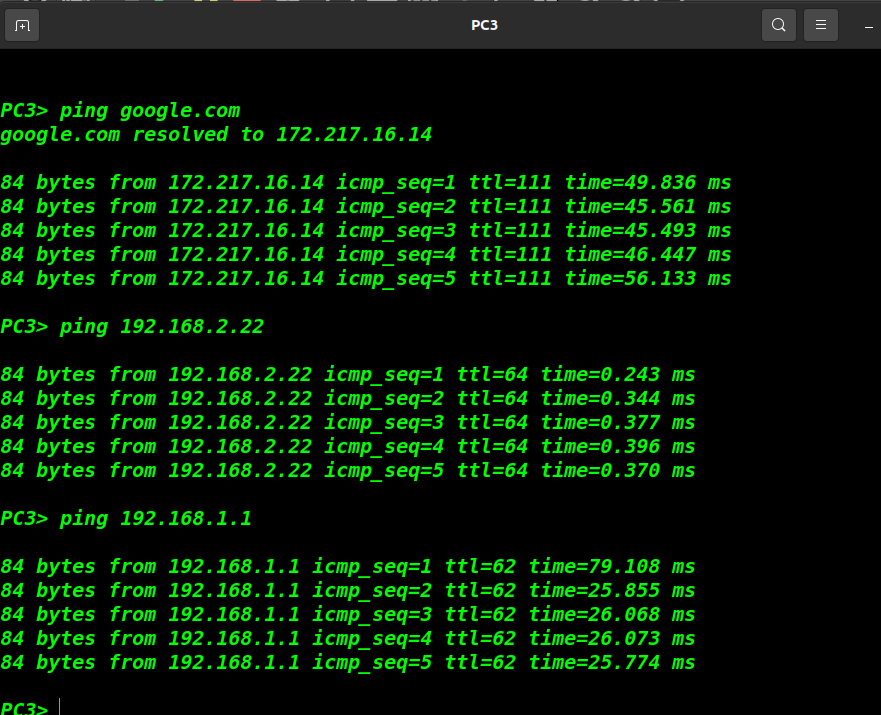

## Przygotowanie
1. Pobrałem z jakiejś stronnki, mam nadzieję że nie z wirusami, obraz routera `c7200`.
2. Pobrałem aplikację `gns3` przez terminal za pomocą *sudo apt install*
3. Zaimportowałem do projektu w `gns3` pobrany router:


<br />
4. Następnie wstawiłem wszystkie elementy sieci aby stworzyć topologię zadaną przez prowadzącego:


<br />
5. W konfiguracji routerow pododawalem odpowiednie porty, by je wzajemnie łączyć:


<br />
6. Skonfigurowałem chmurę tak o:
  1. PPM na chmurę i opcja <mark>**configure**</mark>.
  2. Dodałem interfejs internetowy z opcji <mark>**show special enthernet interfaces**</mark>.
  3. Wybrałem <mark>**virbr0**</mark>.
  4. Laptopa mam podlączonego kabelkiem do routera, wiec nie było problemów  z tym.
7. Następnie zająłem się szczegółową konfiguracją urządzeń.

## Konfiguracja urządzeń

Aby sprawdzić, czy dane urządzenie jest podlączone do sieci, wystarczy spingować googla:
```bash
ping google.com
```
1. Routery:


### `R5`
```bash
conf t
int f0/0
ip address dhcp
ip nat outside
no shut
end

conf t
ip domain-lookup
ip name-server 8.8.8.8
end

conf t
int f1/0
ip add 192.168.3.6 255.255.255.0
ip nat inside
no shut
end

conf t
router rip
version 2
no auto-summary
network 192.168.42.0
network 192.168.3.0
default-information originate
end

conf t
access-list 10 permit 192.168.1.0 0.0.254.255
access-list 10 permit 192.168.2.0 0.0.253.255
access-list 10 permit 192.168.3.0 0.0.252.255
access-list 10 permit 192.168.4.0 0.0.251.255

ip nat inside source list 10 interface f0/0 overload
end

wr
```
### `R6`

```
conf t
int f0/0
no shut
ip add 192.168.3.5 255.255.255.0
end

conf t
ip domain-lookup source-interface f0/0
ip name-server 8.8.8.8
end

conf t
int f1/0
no shut
ip add 192.168.4.2 255.255.255.0
end

conf t
int f2/0
no shut
ip add 192.168.1.11 255.255.255.0
end

conf t
router rip
version 2
no auto-summary
network 192.168.1.0
network 192.168.4.0
network 192.168.3.0
end

wr
```

### `R2`

```
conf t
int f1/0
ip add 192.168.2.1 255.255.255.0
no shut
int f0/0
ip add 192.168.4.6 255.255.255.0
no shut
end

conf t
router rip
version 2
no auto-summary
network 192.168.2.0
network 192.168.4.0
end

conf t
ip domain-lookup
ip name-server 8.8.8.8
end
```

### `R3`

```
conf t
int f0/0
ip add 192.168.2.2 255.255.255.0
no shut
end

conf t
router rip
version 2
no auto-summary
network 192.168.2.0
end

conf t
ip domain-lookup
ip name-server 192.168.42.129
end
wr
```
2. Pecety:

### `PC-1`

```
ip 192.168.1.1/24 192.168.1.11
ip dns 8.8.8.8
wr
```
Sprawdzanie czy jest podlączony do sieci zewnętrznej
```
ping google.pl
google.pl resolved to ...

84 bytes from ...
84 bytes from ...
84 bytes from ...
84 bytes from ...
84 bytes from ...
```

### `PC-2`

```
ip 192.168.2.22/24 192.168.2.1
ip dns 8.8.8.8
wr
```

### `PC-3`

```
ip 192.168.2.3/24 192.168.2.1
ip dns 8.8.8.8
wr
```

Po zakończonej konfiguracji oraz uruchomieniu (*start all nodes*), sieć prezentuje sie następująco:


<br />

## Testowanie czy działa:


<br />
.<br />
.<br />
.<br />
Wystarczy na każdym urządeniu (routerach i pecetach) spingować jakąś stronke internetową oraz inne urządzenia wewnątrz mojej sieci:
<br />


<br />
.<br />

<br />
<br />
Na powyższym zdjęciu widać jak pingowalem PC2 z PC1, mozna zauważyć kilka ciekawych rzeczy:
1. da sie spingować, czyli komputery są polączone w tej sieci
2. wartość ttl z pakietu wysłanego pingiem spadła z 64 na 62, co znaczy że po drodze byly dwa urządzenia
3. trace to potwierdza, wskazał ip dwóch routerów które były po drodze
4. switche nie zabierają pakietowi życia
<br />

## Podglądanie wiresharkiem:
1. Aby przechwytywać komunikaty należy kliknąć ppm na kabel i wybrać opcję **start capture** .
2. Wtedy zostaniemy przekierowani do aplikacji `wireshark`.
3. Można wysłać ping pomiedzy wybranymi urządzeniami i wtedy zobaczymy coś takiego:

.<br />
4. Widzimy tutaj po 5 pakietów dla obu urządzeń:
    - tego co wysyła (PC1 z ip: 192.168.1.1)
    - tego co odbiera (PC2 z ip: 192.168.2.22)
5. Oznacza to że urządzenia wysyłają między sobą pakiety
