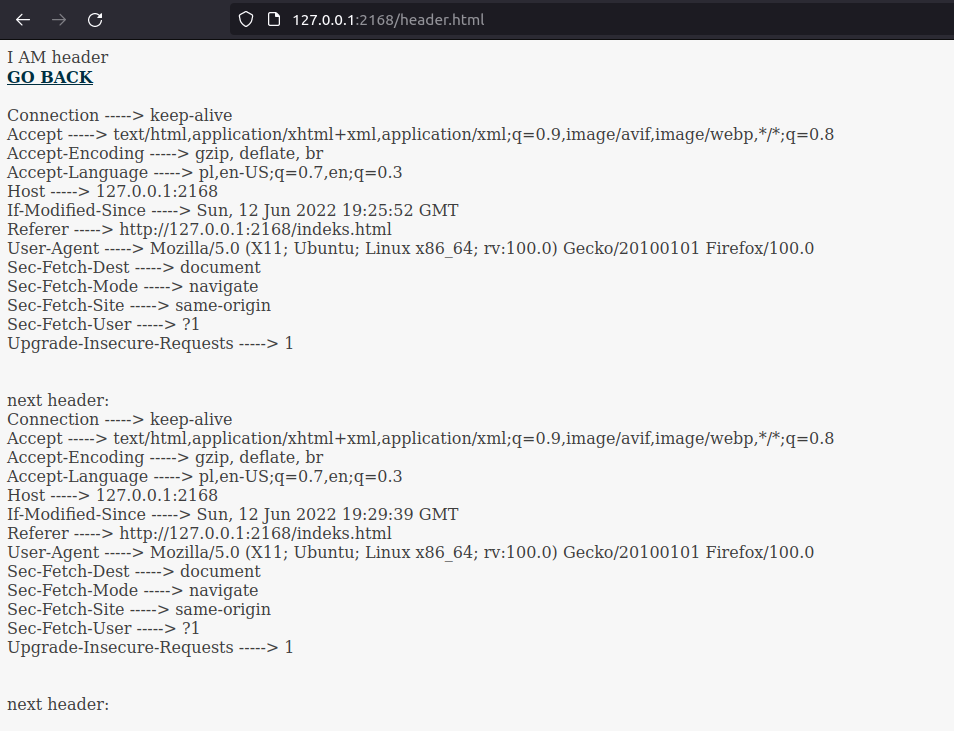

## Lista nr 5 - HTTP
File server3.pl contains example program of a server protocol HTTP.  

1. Execute the script, test and think how it works.
2. Establish connection using web browser.
3. Change script or write your own server, that sends back request header.
4. Change script (or write your own server in any programming language) to manage client requests to simple text WWW service (few static websites with static links to each other) saved in some folder on local disc of user.
5. Intercept communicates to/from server using any analyser - Analyse their structure
6. Write simple report.

## Przygotowanie
1. Pobrałem kod servera i zmieniłem alias ip mojego komputera z `'luki'` na `'locolhost'`
2. Stworzyłem plik indeks.html
<br />
`server.pl:`

```bash
#!usr/bi/perl
use HTTP::Daemon;
use HTTP::Status;  
#use IO::File;
my $d = HTTP::Daemon->new(
         LocalAddr => 'localhost',
         LocalPort => 4321,
     )|| die;

print "Please contact me at: <URL:", $d->url, ">\n";
while (my $c = $d->accept) {
    while (my $r = $c->get_request) {
        if ($r->method eq 'GET') {
            
            $file_s= "./index.html";    # index.html - jakis istniejacy plik
            $c->send_file_response($file_s);
        }
        else {
            $c->send_error(RC_FORBIDDEN)
        }
    }
    $c->close;
    undef($c);
}
```
<br />
3. Uruchomiłem program i wpisałem w przegladarkę danego linka, nic sie nie wyświetliło, bo plik `index.html` był pusty.
<br />

## Podpunkt 3 - przechwycenie nagłówka requesta:
1. Stworzyłem plik `header.html`
2. Wpisałem do niego przekierowanie do strony głównej i jakiś tytuł do wyświetlenia:
```bash
I AM header<br><a href="indeks.html"><strong>GO BACK</strong></a><br>
```
3. Dopisałem następujący ciąg poleceń:
```bash
        if ($r->method eq 'GET') {
            my $header = $r->headers->as_string; #pobieramy rządanie ze zmiennej r i zapisujemy je pod stringiem
            my $filename = "./Web/header.html"; #odnosimy się do pliku header
            open(FH, '>>', $filename) or die $!; #otwieramy

            foreach($r->header_field_names) {
                print FH ($_. "\t----->\t" . $r->header($_) . "<br>" );
            }

            print FH $strendline;
            close(FH); #zamykamy plik ze stroną html (header)
```
4. Podstrona z przechwyconym headerem:
<br />



<br />

## Podpunkt 4 - budowa strony i podstron
1. Zacząłem od przekierowania inicjacji żądania na stronę `main.html`
```bash
            # r->uri A uniform resource identifier, 
            # or URI, is a short string containing a name or address which refers to an object in the "web."
            # w momwncie otwarcia samego adresu, doklejamy do niego strone startową
            if($r->uri eq "/" | $r->uri eq "/favicon.ico"){ #obsluga przekierowań i inicjacji | jakiś smiec ktory si epojawia w uri
                my $file_s= "./Web/main.html";    # main.html - istniejacy plik - strona startowa
                $c->send_file_response($file_s);
            } else{
                $file_s = $dir.$r->uri; #idziemy do folderu z innymi podstronami
                #mam tutaj listę moich podstron
                $c->send_file_response($file_s);
                #przekierowanie na wybraną przez kliknięcie podstronę z hiperłącza
            }
```
2. Gdy pierwszy raz uruchamiam serwer, to przekierowuję od razu na stronę `main.html`
3. Późnije mogę obsługiwać inne przekierowania do kolejnych moich podstronek w katalogu `Web`
